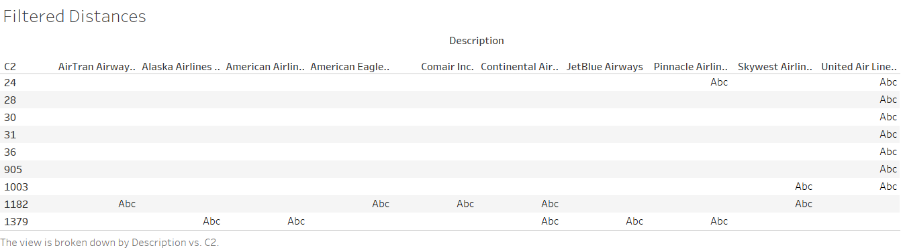

# BigData_Analysis_Final_Project
### Dataset Link: http://stat-computing.org/dataexpo/2009/the-data.html
### Year chosen for data download-2008. Dataset contains information pertaining to each flight trip. 
### The project contains 7 Part, each of which try to answer question stated below. Pig,Hbase,Map Reduce,HDFS,Tableau are mainly used for the analysis
### Which airlines have worst and best departure delays?

### Which airlines have flights travelling distances between 0- 50 miles and 900-1400?

### What will be the Air Traffic for each month in USA?

### Which airline  company offered maximum number of trips in 2008 throughout USA?

### Which city had the  highest flight traffic in 2008?

### How to recommend a particular flights  for a particular day if the given flight has no seats left?

### How to Find the flight that has travelled for maximum amount of time?

